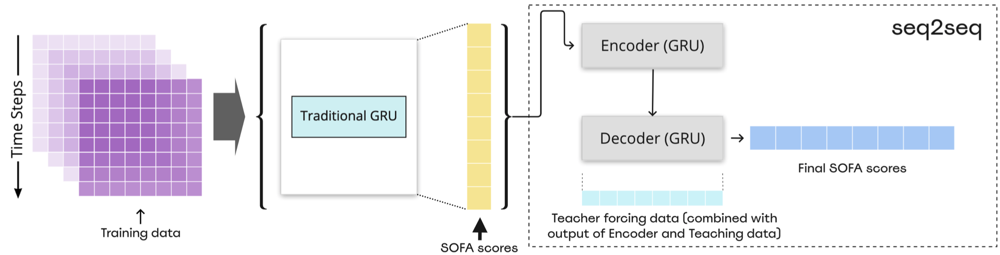

# AI‑monitored‑ICU‑Illness‑severity‑prediction‑for‑ICU
Predicting a patient's SOFA score for the next 24 or 48 hours

## MSNETs -> RNN / GRU / LSTM

# Set-up
## Operation System:
  

## Language and Additional Packages:
        

## GPU:


## Environment
```console
username@localhost:~$ conda install pytorch torchvision torchaudio cudatoolkit=11.6 -c pytorch -c conda-forge
username@localhost:~$ pip install -U scikit-learn
username@localhost:~$ pip install numpy
username@localhost:~$ pip install pandas
username@localhost:~$ pip install tqdm
```

# Quick Start

```console
username@localhost:~$ python /src/run_training.py
```
